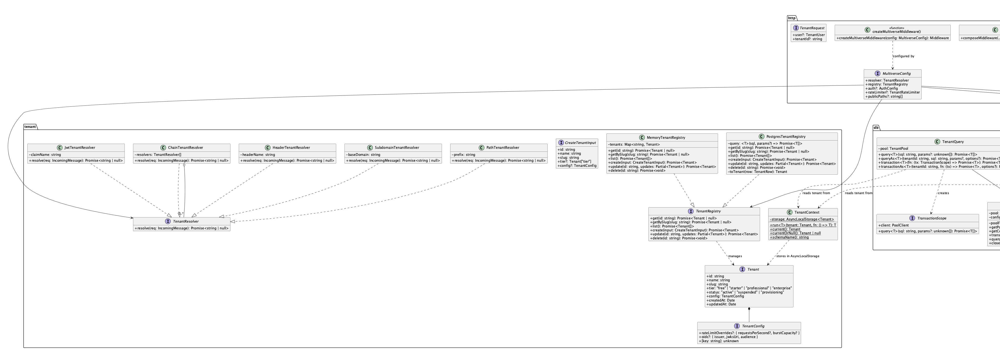
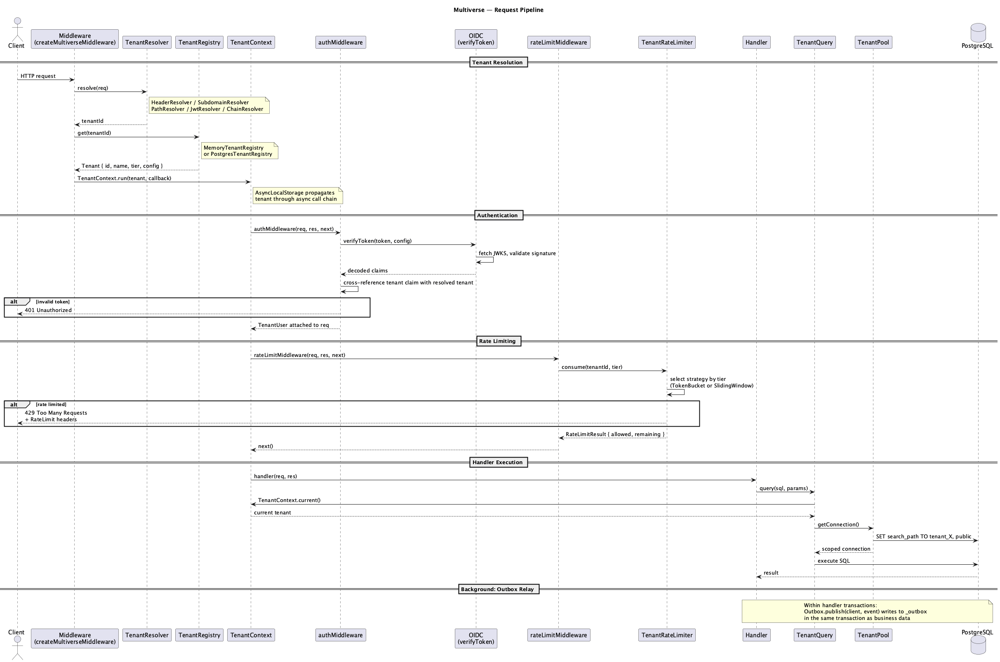

<p align="center">
<h1 align="center">multiverse</h1>
<p align="center">Multi-tenant SaaS framework for TypeScript.<br/>Schema-per-tenant isolation, scoped auth, transactional outbox, rate limiting.</p>
</p>

<p align="center">
  <a href="#why-multiverse">Why multiverse</a> &middot;
  <a href="#features">Features</a> &middot;
  <a href="#quick-start">Quick Start</a> &middot;
  <a href="#usage">Usage</a> &middot;
  <a href="#api-reference">API Reference</a> &middot;
  <a href="#design-decisions">Design Decisions</a> &middot;
  <a href="#architecture">Architecture</a> &middot;
  <a href="#isolation-model">Isolation Model</a>
</p>

## Table of Contents

- [Why multiverse](#why-multiverse)
- [Features](#features)
- [Quick Start](#quick-start)
- [Usage](#usage)
  - [Tenant Resolution](#tenant-resolution)
  - [Database](#database--schema-per-tenant)
  - [Transactional Outbox](#transactional-outbox)
  - [Rate Limiting](#rate-limiting)
  - [Authentication](#authentication)
  - [Full Example](#full-example--multi-tenant-api)
- [API Reference](#api-reference)
  - [Tenant](#tenant)
  - [Database](#database)
  - [Auth](#auth)
  - [Events](#events)
  - [Rate Limiting](#rate-limiting-1)
  - [HTTP](#http)
  - [Errors](#errors)
- [Design Decisions](#design-decisions)
- [Architecture](#architecture)
- [Isolation Model](#isolation-model)
- [Development](#development)
- [License](#license)

---

## Why multiverse

A missing `WHERE tenant_id = ?` clause silently exposes one tenant's data to another. A forgotten rate limit lets one tenant starve the rest. An event published outside a transaction disappears on crash. These are not edge cases. They happen in every multi-tenant codebase eventually.

multiverse prevents them at the framework level. Schema-per-tenant isolation means a bad query cannot leak data because it physically runs in the wrong schema. Rate limits are enforced per tenant before your handler runs. Events are written in the same database transaction as business data, so they never go missing. All of it wires together into a composable middleware stack that works with any Node.js HTTP framework.

---

## Features

- **Schema-per-tenant isolation.** Each tenant gets a dedicated Postgres schema. A missing `WHERE` clause cannot leak data because queries are scoped at the connection level.
- **Pluggable tenant resolution.** Resolve tenants from headers, subdomains, URL paths, JWT claims, or chain multiple strategies with fallback.
- **Implicit tenant propagation.** AsyncLocalStorage carries the tenant context through the entire async call chain. No manual parameter passing.
- **Transactional outbox.** Events are written in the same database transaction as business data. No dual-write inconsistency. No lost events on crash.
- **Per-tenant rate limiting.** Token bucket and sliding window strategies with tier-based overrides. Enterprise tenants get higher limits automatically.
- **Scoped JWT authentication.** Validates tokens from external OIDC providers. Cross-references the JWT tenant claim against the resolved tenant. Supports per-tenant IdPs for enterprise customers.
- **Cross-tenant query prevention.** The query builder rejects any attempt to access a different tenant's schema unless explicitly allowed.

---

## Quick Start

```bash
npm install github:elliot736/multiverse
```

```typescript
import {
  createMultiverseMiddleware,
  MemoryTenantRegistry,
  HeaderTenantResolver,
  TenantPool,
  TenantQuery,
  Outbox,
  TenantRateLimiter,
  TenantContext,
} from "multiverse";
import { createServer } from "node:http";

const registry = new MemoryTenantRegistry();
const pool = new TenantPool({ connectionString: process.env.DATABASE_URL });
const query = new TenantQuery(pool);

const middleware = createMultiverseMiddleware({
  resolver: new HeaderTenantResolver("x-tenant-id"),
  registry,
  auth: { skipAuth: true },
  rateLimiter: new TenantRateLimiter({
    strategy: { type: "token-bucket", capacity: 100, refillRate: 10 },
  }),
  publicPaths: ["/health"],
});

const server = createServer(async (req, res) => {
  await middleware(req, res, async () => {
    const tenant = TenantContext.current();
    const rows = await query.query("SELECT * FROM orders LIMIT 10");
    res.writeHead(200, { "Content-Type": "application/json" });
    res.end(JSON.stringify({ tenant: tenant.id, orders: rows }));
  });
});

server.listen(3000);
```

---

## Usage

### Tenant Resolution

```typescript
import {
  HeaderTenantResolver,
  SubdomainTenantResolver,
  PathTenantResolver,
  JwtTenantResolver,
  ChainTenantResolver,
} from "multiverse";

// From HTTP header (default: x-tenant-id)
const headerResolver = new HeaderTenantResolver("x-tenant-id");

// From subdomain: acme.app.example.com -> "acme"
const subdomainResolver = new SubdomainTenantResolver("app.example.com");

// From URL path: /t/acme/api/orders -> "acme"
const pathResolver = new PathTenantResolver("/t/");

// From JWT claim (decoded, not verified. Verification happens in auth middleware)
const jwtResolver = new JwtTenantResolver("tenant_id");

// Chain: try header first, fall back to subdomain
const chainResolver = new ChainTenantResolver([
  headerResolver,
  subdomainResolver,
]);
```

---

### Database, Schema-Per-Tenant

```typescript
import {
  TenantPool,
  TenantQuery,
  TenantMigrator,
  TenantContext,
} from "multiverse";

const pool = new TenantPool({ connectionString: process.env.DATABASE_URL });
const query = new TenantQuery(pool);
const migrator = new TenantMigrator(pool, "./migrations");

// Provision a new tenant (creates schema + runs migrations)
await migrator.provision("acme");

// Query within a tenant context
await TenantContext.run(tenant, async () => {
  const users = await query.query("SELECT * FROM users WHERE active = $1", [
    true,
  ]);

  // Transaction with automatic BEGIN/COMMIT/ROLLBACK
  await query.transaction(async (tx) => {
    await tx.query("INSERT INTO orders (id, total) VALUES ($1, $2)", [
      "ord-1",
      99.99,
    ]);
    await tx.query("INSERT INTO order_items (order_id, sku) VALUES ($1, $2)", [
      "ord-1",
      "WIDGET",
    ]);
  });
});

// Migrate all existing tenants
const result = await migrator.migrateAll();
console.log(
  `Migrated: ${result.succeeded.length}, Failed: ${result.failed.length}`,
);
```

---

### Transactional Outbox

```typescript
import { Outbox, OutboxRelay, InMemoryEventBus, TenantPool } from "multiverse";

const bus = new InMemoryEventBus();
const outbox = new Outbox();
const relay = new OutboxRelay(pool, bus, { pollIntervalMs: 1000 });

// Write business data + event atomically
await pool.transaction("acme", async (client) => {
  await client.query("INSERT INTO orders (id, total) VALUES ($1, $2)", [
    "ord-1",
    42.0,
  ]);
  await outbox.publish(client, {
    aggregateId: "ord-1",
    aggregateType: "order",
    eventType: "order.created",
    payload: { total: 42.0 },
  });
});
// Both the order and the event commit or roll back together

// Subscribe to events
bus.subscribe("order.created", async (event) => {
  console.log(
    `Order created in tenant ${event.tenantId}: ${event.aggregateId}`,
  );
});

// Start the relay (polls outbox tables, publishes to bus)
await relay.start();
```

---

### Rate Limiting

```typescript
import { TenantRateLimiter } from "multiverse";

// Token bucket: burst of 100, sustained 10/sec
const limiter = new TenantRateLimiter({
  strategy: { type: "token-bucket", capacity: 100, refillRate: 10 },
  tierOverrides: {
    enterprise: { capacity: 1000, refillRate: 100 },
    free: { capacity: 20, refillRate: 2 },
  },
});

// Or sliding window: 10,000 requests per hour
const quotaLimiter = new TenantRateLimiter({
  strategy: {
    type: "sliding-window",
    windowMs: 3_600_000,
    maxRequests: 10_000,
  },
});

// Rate limiting is automatic when passed to createMultiverseMiddleware
```

---

### Authentication

```typescript
import { authMiddleware } from "multiverse";

// Shared OIDC provider (all tenants use the same IdP)
const auth = authMiddleware({
  jwksUri: "https://auth.example.com/.well-known/jwks.json",
  issuer: "https://auth.example.com/",
  audience: "https://api.example.com",
  tenantClaim: "tenant_id",
});

// Per-tenant OIDC (enterprise tenants bring their own IdP)
const perTenantAuth = authMiddleware(
  { perTenantProviders: true, tenantClaim: "tenant_id" },
  registry, // TenantRegistry with oidc config per tenant
);
```

---

### Full Example, Multi-Tenant API

```typescript
import {
  createMultiverseMiddleware,
  MemoryTenantRegistry,
  HeaderTenantResolver,
  TenantPool,
  TenantQuery,
  TenantMigrator,
  Outbox,
  OutboxRelay,
  InMemoryEventBus,
  TenantRateLimiter,
  TenantContext,
  getUser,
} from "multiverse";
import { createServer } from "node:http";

const registry = new MemoryTenantRegistry();
const pool = new TenantPool({ connectionString: process.env.DATABASE_URL! });
const query = new TenantQuery(pool);
const migrator = new TenantMigrator(pool, "./migrations");
const bus = new InMemoryEventBus();
const outbox = new Outbox();
const relay = new OutboxRelay(pool, bus, { pollIntervalMs: 1000 });

const rateLimiter = new TenantRateLimiter({
  strategy: { type: "token-bucket", capacity: 100, refillRate: 10 },
  tierOverrides: { enterprise: { capacity: 1000, refillRate: 100 } },
});

const middleware = createMultiverseMiddleware({
  resolver: new HeaderTenantResolver("x-tenant-id"),
  registry,
  auth: {
    jwksUri: process.env.JWKS_URI!,
    issuer: process.env.OIDC_ISSUER!,
    audience: process.env.OIDC_AUDIENCE!,
  },
  rateLimiter,
  publicPaths: ["/health"],
});

bus.subscribe("order.created", async (event) => {
  console.log(`[${event.tenantId}] New order: ${event.aggregateId}`);
});

const server = createServer(async (req, res) => {
  await middleware(req, res, async () => {
    const tenant = TenantContext.current();
    const user = getUser(req);

    // Create an order with an atomic event
    const orderId = `ord-${Date.now()}`;
    await pool.transaction(tenant.id, async (client) => {
      await client.query(
        "INSERT INTO orders (id, user_id, total) VALUES ($1, $2, $3)",
        [orderId, user?.sub, 42.0],
      );
      await outbox.publish(client, {
        aggregateId: orderId,
        aggregateType: "order",
        eventType: "order.created",
        payload: { total: 42.0, userId: user?.sub },
      });
    });

    res.writeHead(201, { "Content-Type": "application/json" });
    res.end(JSON.stringify({ orderId, tenant: tenant.id }));
  });
});

async function start() {
  const tenant = await registry.create({
    id: "acme",
    name: "Acme Corp",
    slug: "acme",
    tier: "professional",
  });
  await migrator.provision(tenant.id);
  await registry.update(tenant.id, { status: "active" });
  await relay.start();
  server.listen(3000, () => console.log("Listening on :3000"));
}

start();
```

---

## API Reference

### Tenant

| Export                          | Type   | Description                                        |
| ------------------------------- | ------ | -------------------------------------------------- |
| `TenantContext`                 | class  | AsyncLocalStorage-based tenant propagation         |
| `TenantContext.run(tenant, fn)` | static | Execute `fn` within a tenant context               |
| `TenantContext.current()`       | static | Get current tenant or throw `NoTenantContextError` |
| `TenantContext.currentOrNull()` | static | Get current tenant or `null`                       |
| `TenantContext.schemaName()`    | static | Returns `tenant_{id}` for the current tenant       |
| `HeaderTenantResolver`          | class  | Resolves tenant from an HTTP header                |
| `SubdomainTenantResolver`       | class  | Resolves tenant from the request subdomain         |
| `PathTenantResolver`            | class  | Resolves tenant from a URL path segment            |
| `JwtTenantResolver`             | class  | Resolves tenant from a JWT claim (decode only)     |
| `ChainTenantResolver`           | class  | Tries multiple resolvers in order                  |
| `MemoryTenantRegistry`          | class  | In-memory tenant CRUD (dev/test)                   |
| `PostgresTenantRegistry`        | class  | Postgres-backed tenant CRUD (production)           |

### Database

| Export                                             | Type   | Description                                          |
| -------------------------------------------------- | ------ | ---------------------------------------------------- |
| `TenantPool`                                       | class  | Connection pool with automatic `search_path` scoping |
| `TenantPool.getConnection(tenantId)`               | method | Get a schema-scoped connection                       |
| `TenantPool.transaction(tenantId, fn)`             | method | Execute `fn` in a scoped transaction                 |
| `TenantQuery`                                      | class  | Tenant-safe query builder using AsyncLocalStorage    |
| `TenantQuery.query(sql, params)`                   | method | Query scoped to current tenant context               |
| `TenantQuery.queryAs(tenantId, sql, params, opts)` | method | Query a specific tenant (with cross-tenant guard)    |
| `TenantQuery.transaction(fn)`                      | method | Scoped transaction using current tenant context      |
| `TenantMigrator`                                   | class  | Per-tenant schema migration runner                   |
| `TenantMigrator.provision(tenantId)`               | method | Create schema, outbox table, run migrations          |
| `TenantMigrator.migrate(tenantId)`                 | method | Run pending migrations for a tenant                  |
| `TenantMigrator.migrateAll()`                      | method | Migrate all tenant schemas                           |

### Auth

| Export                              | Type     | Description                                         |
| ----------------------------------- | -------- | --------------------------------------------------- |
| `authMiddleware(config, registry?)` | function | JWT validation middleware with tenant scoping        |
| `getUser(req)`                      | function | Extract authenticated user from request (or `null`)  |
| `requireUser(req)`                  | function | Extract authenticated user or throw                  |
| `verifyToken(token, config)`        | function | Verify a JWT and return the payload                  |
| `decodeToken(token)`                | function | Decode a JWT without verification                    |
| `clearJwksCache()`                  | function | Clear cached JWKS key sets                           |

### Events

| Export                               | Type   | Description                                      |
| ------------------------------------ | ------ | ------------------------------------------------ |
| `Outbox`                             | class  | Write events to `_outbox` table in a transaction |
| `Outbox.publish(client, event)`      | method | Write a single event                             |
| `Outbox.publishMany(client, events)` | method | Write multiple events in a batch                 |
| `OutboxRelay`                        | class  | Polls outbox tables and publishes to EventBus    |
| `OutboxRelay.start()`                | method | Start polling                                    |
| `OutboxRelay.stop()`                 | method | Stop gracefully                                  |
| `OutboxRelay.pollOnce()`             | method | Run a single poll cycle (testing)                |
| `InMemoryEventBus`                   | class  | In-memory event bus for single-process apps      |

### Rate Limiting

| Export                        | Type     | Description                                     |
| ----------------------------- | -------- | ----------------------------------------------- |
| `TokenBucketLimiter`          | class    | Token bucket algorithm (burst + sustained rate) |
| `SlidingWindowLimiter`        | class    | Sliding window algorithm (quota enforcement)    |
| `TenantRateLimiter`           | class    | Per-tenant rate limiting with tier overrides     |
| `rateLimitMiddleware(config)` | function | HTTP middleware for rate limiting                |

### HTTP

| Export                               | Type     | Description                            |
| ------------------------------------ | -------- | -------------------------------------- |
| `createMultiverseMiddleware(config)` | function | Compose the full middleware stack      |
| `composeMiddleware(...mws)`          | function | Generic middleware composition utility |

### Errors

| Export                   | Code                      | Description                                |
| ------------------------ | ------------------------- | ------------------------------------------ |
| `MultiverseError`        |                           | Base error class                           |
| `TenantNotFoundError`    | `TENANT_NOT_FOUND`        | Tenant does not exist in registry          |
| `CrossTenantAccessError` | `CROSS_TENANT_ACCESS`     | Attempted access to another tenant's data  |
| `NoTenantContextError`   | `NO_TENANT_CONTEXT`       | Code running outside `TenantContext.run()` |
| `RateLimitExceededError` | `RATE_LIMIT_EXCEEDED`     | Tenant exceeded rate limit                 |
| `OutboxPublishError`     | `OUTBOX_PUBLISH_ERROR`    | Failed to write event to outbox            |
| `AuthenticationError`    | `AUTHENTICATION_ERROR`    | JWT validation failed                      |
| `TenantResolutionError`  | `TENANT_RESOLUTION_ERROR` | Could not resolve tenant from request      |
| `MigrationError`         | `MIGRATION_ERROR`         | Schema migration failed                    |

---

## Design Decisions

- **Schema-per-tenant over row-level isolation.** Schema boundaries enforce isolation at the database level. A missing `WHERE` clause cannot leak data. [ADR-001](docs/adr/001-schema-per-tenant-isolation.md)
- **Transactional outbox over direct publishing.** Events are written in the same transaction as business data. No lost events on crash, no dual-write inconsistency. [ADR-002](docs/adr/002-transactional-outbox.md)
- **AsyncLocalStorage for implicit propagation.** Tenant context flows through async call chains without parameter drilling. [ADR-003](docs/adr/003-tenant-resolution.md)
- **Token bucket + sliding window for rate limiting.** Token bucket handles burst traffic. Sliding window enforces quotas. Both scope by tenant automatically. [ADR-004](docs/adr/004-rate-limiting-strategy.md)
- **JWT middleware, not full auth server.** Validates tokens from external OIDC providers. Supports shared and per-tenant IdPs. [ADR-005](docs/adr/005-auth-architecture.md)

See [Architecture Decision Records](docs/adr/) for full context and trade-off analysis.

---

## Architecture

### Class Diagram



### Sequence Diagram



---

## Isolation Model

|                               | Row-Level (`tenant_id` column)        | Schema-Per-Tenant                           | Database-Per-Tenant           |
| ----------------------------- | ------------------------------------- | ------------------------------------------- | ----------------------------- |
| **Isolation strength**        | Low. One missing `WHERE` leaks data.  | High. Schema boundary enforced by DB.       | Highest. Separate databases.  |
| **Migration complexity**      | Single migration for all tenants      | One migration per tenant schema             | One migration per database    |
| **Connection overhead**       | Single pool                           | Single pool, `SET search_path` per checkout | Pool per database             |
| **Per-tenant backup/restore** | Difficult (extract rows by ID)        | Simple (`pg_dump -n tenant_xyz`)            | Trivial (dump entire DB)      |
| **Tenant count ceiling**      | Unlimited                             | ~10,000 (Postgres catalog)                  | Hundreds (operational cost)   |
| **Cost**                      | Lowest                                | Low                                         | High                          |

multiverse uses **schema-per-tenant** as the default. It provides strong isolation without the operational overhead of per-database isolation, and it eliminates the data-leak risk of row-level filtering.

---

## Development

```bash
git clone https://github.com/elliot736/multiverse.git
cd multiverse
npm install
npm test               # Run tests
npm run test:coverage  # Run tests with coverage
npm run lint           # Lint
npm run typecheck      # Type check
npm run build          # Compile TypeScript
```

---

## License

MIT
