# multiverse

> An opinionated TypeScript framework for building multi-tenant SaaS applications, tenant isolation, scoped auth, transactional outbox, and rate limiting out of the box.

[](https://github.com/elliot736/multiverse/actions/workflows/ci.yml)
[](https://typescriptlang.org)
[](LICENSE)

## Why multiverse?

Building multi-tenant SaaS is hard. Tenant isolation, cross-tenant data leaks, noisy neighbors, auth scoping -- most teams hand-roll these primitives and get them wrong. A missing `WHERE tenant_id = ?` clause silently exposes data. A forgotten rate limit lets one tenant starve the rest. An event published outside a transaction disappears on crash.

multiverse provides production-tested building blocks so you can focus on your product. Schema-per-tenant isolation enforced at the database level, scoped JWT validation, transactional event publishing, and per-tenant rate limiting -- all wired together into a composable middleware stack that works with any Node.js HTTP framework.

## Features

- **Schema-per-tenant isolation** -- each tenant gets a dedicated Postgres schema; cross-tenant queries are rejected at the framework level
- **Pluggable tenant resolution** -- header, subdomain, path, JWT, or custom resolvers with chain fallback
- **Scoped authentication** -- JWT validation with tenant claim enforcement, per-tenant OIDC provider support
- **Transactional outbox** -- reliable event publishing with exactly-once semantics via the outbox pattern
- **Per-tenant rate limiting** -- token bucket + sliding window with tier-based overrides
- **Implicit tenant propagation** -- AsyncLocalStorage-based context, no manual parameter passing
- **Cross-tenant access prevention** -- query builder rejects cross-schema access unless explicitly allowed

## Architecture

### Component Diagram

```plantuml
@startuml component-diagram
skinparam componentStyle rectangle
skinparam defaultTextAlignment center

title Multiverse — Component Diagram

' ──────────────────────────────────────
' External actors
' ──────────────────────────────────────
actor "Client" as client
database "PostgreSQL" as pg

' ──────────────────────────────────────
' Modules
' ──────────────────────────────────────
package "Multiverse Framework" {

  component [HTTP Module] as http {
    portin "incoming request" as httpIn
    portout "handler response" as httpOut
    card "createMultiverseMiddleware()" as createMw
    card "composeMiddleware()" as composeMw
    card "MultiverseConfig" as mvConfig
    card "TenantRequest" as tenantReq
  }

  component [Tenant Module] as tenant {
    card "TenantContext\n(AsyncLocalStorage)" as tenantCtx
    card "TenantResolver" as resolver
    card "HeaderTenantResolver" as headerRes
    card "SubdomainTenantResolver" as subdomainRes
    card "PathTenantResolver" as pathRes
    card "JwtTenantResolver" as jwtRes
    card "ChainTenantResolver" as chainRes
    card "TenantRegistry" as registry
    card "MemoryTenantRegistry" as memReg
    card "PostgresTenantRegistry" as pgReg
  }

  component [Auth Module] as auth {
    card "authMiddleware()" as authMw
    card "verifyToken() / decodeToken()" as oidc
    card "TenantUser" as tenantUser
    card "AuthConfig" as authCfg
  }

  component [Rate Limit Module] as ratelimit {
    card "TenantRateLimiter" as tenantRL
    card "rateLimitMiddleware()" as rlMw
    card "TokenBucketLimiter" as tokenBucket
    card "SlidingWindowLimiter" as slidingWindow
  }

  component [DB Module] as db {
    card "TenantPool" as pool
    card "TenantQuery" as query
    card "TenantMigrator" as migrator
    card "TransactionScope" as txScope
  }

  component [Events Module] as events {
    card "Outbox" as outbox
    card "OutboxRelay" as relay
    card "EventBus" as eventBus
    card "InMemoryEventBus" as memBus
  }

  component [Errors] as errors {
    card "MultiverseError\nhierarchy" as errBase
  }
}

' ──────────────────────────────────────
' Request pipeline (numbered sequence)
' ──────────────────────────────────────
client --> httpIn : "1. HTTP Request"

http --> tenant : "2. Resolve tenant ID\n   (TenantResolver)"
tenant --> tenant : "3. Look up tenant\n   (TenantRegistry.get)"
tenant --> tenantCtx : "4. TenantContext.run()\n   propagate via AsyncLocalStorage"

http --> auth : "5. Validate JWT\n   (authMiddleware)"
auth --> oidc : "verify signature,\nissuer, audience"
auth --> tenantCtx : "cross-reference\ntenant claim"

http --> ratelimit : "6. Check rate limit\n   (rateLimitMiddleware)"
ratelimit --> tenantCtx : "read tenant + tier"
ratelimit --> tenantRL : "consume tokens"

httpOut --> client : "7. Response"

' ──────────────────────────────────────
' Handler data access
' ──────────────────────────────────────
query --> pool : "getConnection()\nSET search_path"
pool --> pg : "tenant-scoped\nSQL queries"
query --> tenantCtx : "read current tenant"
migrator --> pool : "CREATE SCHEMA\nrun migrations"
outbox --> pg : "INSERT INTO _outbox\n(within transaction)"

' ──────────────────────────────────────
' Background: Outbox relay
' ──────────────────────────────────────
relay --> pool : "poll _outbox tables\nacross all schemas"
relay --> eventBus : "publish DomainEvent"
memBus -.-> eventBus : implements

' ──────────────────────────────────────
' Cross-module dependencies
' ──────────────────────────────────────
pgReg --> pg : "public.tenants table"
authMw ..> registry : "per-tenant OIDC lookup"
errors <.. http : throws
errors <.. db : throws
errors <.. auth : throws
errors <.. events : throws

' ──────────────────────────────────────
' Legend
' ──────────────────────────────────────
legend right
  |= Flow |= Description |
  | 1 | Client sends HTTP request |
  | 2 | Public path check, then resolve tenant ID |
  | 3 | Validate tenant exists and is active |
  | 4 | Wrap remainder in TenantContext.run() |
  | 5 | JWT verification + tenant cross-reference |
  | 6 | Per-tenant rate limiting (tier-aware) |
  | 7 | Handler executes with TenantQuery / Outbox |
  | BG | OutboxRelay polls _outbox, publishes to EventBus |
endlegend

@enduml
```

### Class Diagram

```plantuml
@startuml class-diagram
skinparam classAttributeIconSize 0
skinparam groupInheritance 2
hide empty members

title Multiverse — Class Diagram

' ──────────────────────────────────────
' Tenant module
' ──────────────────────────────────────
package "tenant" {
  interface Tenant {
    +id: string
    +name: string
    +slug: string
    +tier: "free" | "starter" | "professional" | "enterprise"
    +status: "active" | "suspended" | "provisioning"
    +config: TenantConfig
    +createdAt: Date
    +updatedAt: Date
  }

  interface TenantConfig {
    +rateLimitOverrides?: { requestsPerSecond?, burstCapacity? }
    +oidc?: { issuer, jwksUri, audience }
    +[key: string]: unknown
  }

  class TenantContext {
    -{static} storage: AsyncLocalStorage<Tenant>
    +{static} run<T>(tenant: Tenant, fn: () => T): T
    +{static} current(): Tenant
    +{static} currentOrNull(): Tenant | null
    +{static} schemaName(): string
  }

  interface TenantResolver {
    +resolve(req: IncomingMessage): Promise<string | null>
  }

  class HeaderTenantResolver {
    -headerName: string
    +resolve(req: IncomingMessage): Promise<string | null>
  }

  class SubdomainTenantResolver {
    -baseDomain: string
    +resolve(req: IncomingMessage): Promise<string | null>
  }

  class PathTenantResolver {
    -prefix: string
    +resolve(req: IncomingMessage): Promise<string | null>
  }

  class JwtTenantResolver {
    -claimName: string
    +resolve(req: IncomingMessage): Promise<string | null>
  }

  class ChainTenantResolver {
    -resolvers: TenantResolver[]
    +resolve(req: IncomingMessage): Promise<string | null>
  }

  interface CreateTenantInput {
    +id: string
    +name: string
    +slug: string
    +tier?: Tenant["tier"]
    +config?: TenantConfig
  }

  interface TenantRegistry {
    +get(id: string): Promise<Tenant | null>
    +getBySlug(slug: string): Promise<Tenant | null>
    +list(): Promise<Tenant[]>
    +create(input: CreateTenantInput): Promise<Tenant>
    +update(id: string, updates: Partial<Tenant>): Promise<Tenant>
    +delete(id: string): Promise<void>
  }

  class MemoryTenantRegistry {
    -tenants: Map<string, Tenant>
    +get(id: string): Promise<Tenant | null>
    +getBySlug(slug: string): Promise<Tenant | null>
    +list(): Promise<Tenant[]>
    +create(input: CreateTenantInput): Promise<Tenant>
    +update(id: string, updates: Partial<Tenant>): Promise<Tenant>
    +delete(id: string): Promise<void>
  }

  class PostgresTenantRegistry {
    -query: <T>(sql, params?) => Promise<T[]>
    +get(id: string): Promise<Tenant | null>
    +getBySlug(slug: string): Promise<Tenant | null>
    +list(): Promise<Tenant[]>
    +create(input: CreateTenantInput): Promise<Tenant>
    +update(id: string, updates: Partial<Tenant>): Promise<Tenant>
    +delete(id: string): Promise<void>
    -toTenant(row: TenantRow): Tenant
  }

  Tenant *-- TenantConfig
  TenantContext ..> Tenant : stores in AsyncLocalStorage
  HeaderTenantResolver ..|> TenantResolver
  SubdomainTenantResolver ..|> TenantResolver
  PathTenantResolver ..|> TenantResolver
  JwtTenantResolver ..|> TenantResolver
  ChainTenantResolver ..|> TenantResolver
  ChainTenantResolver o-- "1..*" TenantResolver
  MemoryTenantRegistry ..|> TenantRegistry
  PostgresTenantRegistry ..|> TenantRegistry
  TenantRegistry ..> Tenant : manages
}

' ──────────────────────────────────────
' DB module
' ──────────────────────────────────────
package "db" {
  class TenantPool {
    -pool: Pool | null
    -config: PoolConfig
    -poolFactory: (config) => Pool
    +getPool(): Pool
    +getConnection(tenantId: string): Promise<PoolClient>
    +transaction<T>(tenantId: string, fn: (client) => Promise<T>): Promise<T>
    +queryPublic<T>(sql: string, params?: unknown[]): Promise<T[]>
    +close(): Promise<void>
  }

  class TenantQuery {
    -pool: TenantPool
    +query<T>(sql: string, params?: unknown[]): Promise<T[]>
    +queryAs<T>(tenantId: string, sql: string, params?, options?): Promise<T[]>
    +transaction<T>(fn: (tx: TransactionScope) => Promise<T>): Promise<T>
    +transactionAs<T>(tenantId: string, fn: (tx) => Promise<T>, options?): Promise<T>
  }

  interface TransactionScope {
    +query<T>(sql: string, params?: unknown[]): Promise<T[]>
    +client: PoolClient
  }

  class TenantMigrator {
    -pool: TenantPool
    -migrationsDir: string
    +provision(tenantId: string): Promise<void>
    +migrate(tenantId: string): Promise<void>
    +migrateAll(): Promise<MigrateAllResult>
    +deprovision(tenantId: string): Promise<void>
    -loadMigrations(): Promise<Migration[]>
  }

  interface MigrateAllResult {
    +succeeded: string[]
    +failed: Array<{ tenantId, error }>
  }

  TenantQuery --> TenantPool : uses
  TenantQuery ..> TenantContext : reads tenant from
  TenantQuery ..> TransactionScope : creates
  TenantMigrator --> TenantPool : uses
  TenantMigrator ..> MigrateAllResult : returns
}

' ──────────────────────────────────────
' Auth module
' ──────────────────────────────────────
package "auth" {
  interface TenantUser {
    +sub: string
    +tenantId: string
    +email?: string
    +name?: string
    +roles: string[]
    +claims: JWTPayload
  }

  interface AuthConfig {
    +jwksUri?: string
    +issuer?: string
    +audience?: string
    +tenantClaim?: string
    +rolesClaim?: string
    +perTenantProviders?: boolean
    +skipAuth?: boolean
  }

  interface TenantOidcConfig {
    +issuer: string
    +jwksUri: string
    +audience: string
  }

  interface AuthenticatedRequest {
    +user?: TenantUser
  }

  class "authMiddleware()" as authMiddlewareFn <<function>> {
    +authMiddleware(config: AuthConfig, registry?: TenantRegistry): Middleware
  }

  class "oidc" as oidcFns <<functions>> {
    +verifyToken(token: string, config: TenantOidcConfig): Promise<JWTPayload>
    +decodeToken(token: string): JWTPayload
    +clearJwksCache(): void
  }

  class "helpers" as authHelpers <<functions>> {
    +getUser(req: IncomingMessage): TenantUser | null
    +requireUser(req: IncomingMessage): TenantUser
  }

  authMiddlewareFn ..> AuthConfig : configured by
  authMiddlewareFn ..> TenantUser : produces
  authMiddlewareFn ..> oidcFns : delegates to
  AuthenticatedRequest o-- TenantUser
}

' ──────────────────────────────────────
' Events module
' ──────────────────────────────────────
package "events" {
  interface OutboxEvent {
    +aggregateId: string
    +aggregateType: string
    +eventType: string
    +payload: Record<string, unknown>
    +idempotencyKey?: string
  }

  interface DomainEvent {
    +id: string
    +tenantId: string
    +aggregateId: string
    +aggregateType: string
    +eventType: string
    +payload: Record<string, unknown>
    +idempotencyKey: string
    +createdAt: Date
  }

  interface OutboxRow {
    +id: string
    +aggregate_id: string
    +aggregate_type: string
    +event_type: string
    +payload: Record<string, unknown>
    +idempotency_key: string | null
    +created_at: Date
    +delivered_at: Date | null
    +retry_count: number
  }

  interface EventBus {
    +publish(event: DomainEvent): Promise<void>
    +subscribe(eventType: string, handler: EventHandler): void
    +unsubscribe(eventType: string, handler: EventHandler): void
  }

  class InMemoryEventBus {
    -handlers: Map<string, Set<EventHandler>>
    -wildcardHandlers: Set<EventHandler>
    +publish(event: DomainEvent): Promise<void>
    +subscribe(eventType: string, handler: EventHandler): void
    +unsubscribe(eventType: string, handler: EventHandler): void
    +clear(): void
    +handlerCount(eventType: string): number
  }

  class Outbox {
    +publish(client: PoolClient, event: OutboxEvent): Promise<void>
    +publishMany(client: PoolClient, events: OutboxEvent[]): Promise<void>
  }

  class OutboxRelay {
    -options: Required<RelayOptions>
    -running: boolean
    -pollTimer: Timeout | null
    -pool: TenantPool
    -bus: EventBus
    +start(): Promise<void>
    +stop(): Promise<void>
    +isRunning: boolean
    +pollOnce(): Promise<PollResult>
    +cleanup(): Promise<number>
    -poll(): Promise<PollResult>
    -processTenantOutbox(tenantId): Promise<{processed, failed}>
  }

  interface RelayOptions {
    +pollIntervalMs?: number
    +batchSize?: number
    +maxRetries?: number
    +retryBackoffMs?: number
    +cleanupAfterMs?: number
  }

  interface PollResult {
    +processed: number
    +failed: number
    +tenantErrors: Array<{ tenantId, error }>
  }

  InMemoryEventBus ..|> EventBus
  OutboxRelay --> EventBus : publishes to
  OutboxRelay --> TenantPool : reads outbox via
  OutboxRelay ..> RelayOptions : configured by
  OutboxRelay ..> PollResult : returns
  OutboxRelay ..> DomainEvent : constructs from OutboxRow
  Outbox ..> OutboxEvent : writes
  OutboxRow ..> DomainEvent : mapped to
}

' ──────────────────────────────────────
' RateLimit module
' ──────────────────────────────────────
package "ratelimit" {
  interface RateLimitResult {
    +allowed: boolean
    +remaining: number
    +retryAfterMs?: number
    +limit: number
  }

  interface RateLimiter {
    +consume(key: string, tokens?: number): Promise<RateLimitResult>
    +reset(key: string): Promise<void>
  }

  interface TokenBucketConfig {
    +capacity: number
    +refillRate: number
  }

  interface SlidingWindowConfig {
    +windowMs: number
    +maxRequests: number
  }

  class TokenBucketLimiter {
    -buckets: Map<string, TokenBucket>
    -config: TokenBucketConfig
    +consume(key: string, tokens?: number): Promise<RateLimitResult>
    +reset(key: string): Promise<void>
    +destroy(): void
    -cleanupStale(): void
  }

  class SlidingWindowLimiter {
    -windows: Map<string, SlidingWindowState>
    -config: SlidingWindowConfig
    +consume(key: string, tokens?: number): Promise<RateLimitResult>
    +reset(key: string): Promise<void>
    +destroy(): void
    -cleanupStale(): void
  }

  class TenantRateLimiter {
    -defaultLimiter: RateLimiter
    -tierLimiters: Map<string, RateLimiter>
    -config: TenantRateLimiterConfig
    +consume(tokens?: number): Promise<RateLimitResult>
    +consumeForTenant(tenant: Tenant, tokens?: number): Promise<RateLimitResult>
    +reset(): Promise<void>
    +destroy(): void
    -buildKey(tenant: Tenant): string
    -createLimiter(config): RateLimiter
  }

  interface RateLimitMiddlewareConfig {
    +limiter: TenantRateLimiter
    +tokensPerRequest?: number
    +keyGenerator?: (req) => string | undefined
    +onRateLimited?: (req, res, retryAfterMs) => void
  }

  TokenBucketLimiter ..|> RateLimiter
  SlidingWindowLimiter ..|> RateLimiter
  TokenBucketLimiter ..> TokenBucketConfig : configured by
  SlidingWindowLimiter ..> SlidingWindowConfig : configured by
  TenantRateLimiter --> RateLimiter : delegates to
  TenantRateLimiter ..> TenantContext : reads tenant from
  RateLimitMiddlewareConfig --> TenantRateLimiter
}

' ──────────────────────────────────────
' HTTP module
' ──────────────────────────────────────
package "http" {
  interface TenantRequest {
    +user?: TenantUser
    +tenantId?: string
  }

  interface MultiverseConfig {
    +resolver: TenantResolver
    +registry: TenantRegistry
    +auth?: AuthConfig
    +rateLimiter?: TenantRateLimiter
    +publicPaths?: string[]
  }

  class "createMultiverseMiddleware()" as createMwFn <<function>> {
    +createMultiverseMiddleware(config: MultiverseConfig): Middleware
  }

  class "composeMiddleware()" as composeFn <<function>> {
    +composeMiddleware(...middlewares: Middleware[]): Middleware
  }

  createMwFn ..> MultiverseConfig : configured by
  MultiverseConfig --> TenantResolver
  MultiverseConfig --> TenantRegistry
  MultiverseConfig --> AuthConfig
  MultiverseConfig --> TenantRateLimiter
}

' ──────────────────────────────────────
' Error hierarchy
' ──────────────────────────────────────
package "errors" {
  class MultiverseError {
    +code: string
    +message: string
  }

  class TenantNotFoundError {
    +tenantId: string
  }

  class CrossTenantAccessError {
    +requestedTenantId: string
    +currentTenantId: string
  }

  class NoTenantContextError

  class RateLimitExceededError {
    +tenantId: string
    +retryAfterMs: number
  }

  class OutboxPublishError {
    +originalError: Error
  }

  class AuthenticationError

  class TenantResolutionError

  class MigrationError {
    +tenantId: string
    +migration: string
  }

  MultiverseError <|-- TenantNotFoundError
  MultiverseError <|-- CrossTenantAccessError
  MultiverseError <|-- NoTenantContextError
  MultiverseError <|-- RateLimitExceededError
  MultiverseError <|-- OutboxPublishError
  MultiverseError <|-- AuthenticationError
  MultiverseError <|-- TenantResolutionError
  MultiverseError <|-- MigrationError
}

@enduml
```



## Quick Start

```typescript
import {
  createMultiverseMiddleware,
  MemoryTenantRegistry,
  HeaderTenantResolver,
  TenantPool,
  TenantQuery,
  Outbox,
  TenantRateLimiter,
  TenantContext,
} from "multiverse";
import { createServer } from "node:http";

const registry = new MemoryTenantRegistry();
const pool = new TenantPool({ connectionString: process.env.DATABASE_URL });
const query = new TenantQuery(pool);

const middleware = createMultiverseMiddleware({
  resolver: new HeaderTenantResolver("x-tenant-id"),
  registry,
  auth: { skipAuth: true },
  rateLimiter: new TenantRateLimiter({
    strategy: { type: "token-bucket", capacity: 100, refillRate: 10 },
  }),
  publicPaths: ["/health"],
});

const server = createServer(async (req, res) => {
  await middleware(req, res, async () => {
    const tenant = TenantContext.current();
    const rows = await query.query("SELECT * FROM orders LIMIT 10");
    res.writeHead(200, { "Content-Type": "application/json" });
    res.end(JSON.stringify({ tenant: tenant.id, orders: rows }));
  });
});

server.listen(3000);
```

## Usage

### Tenant Resolution

```typescript
import {
  HeaderTenantResolver,
  SubdomainTenantResolver,
  PathTenantResolver,
  JwtTenantResolver,
  ChainTenantResolver,
} from "multiverse";

// From HTTP header (default: x-tenant-id)
const headerResolver = new HeaderTenantResolver("x-tenant-id");

// From subdomain: acme.app.example.com -> "acme"
const subdomainResolver = new SubdomainTenantResolver("app.example.com");

// From URL path: /t/acme/api/orders -> "acme"
const pathResolver = new PathTenantResolver("/t/");

// From JWT claim (decoded, not verified -- verification happens in auth middleware)
const jwtResolver = new JwtTenantResolver("tenant_id");

// Chain: try header first, fall back to subdomain
const chainResolver = new ChainTenantResolver([
  headerResolver,
  subdomainResolver,
]);
```

### Database -- Schema-Per-Tenant

```typescript
import {
  TenantPool,
  TenantQuery,
  TenantMigrator,
  TenantContext,
} from "multiverse";

const pool = new TenantPool({ connectionString: process.env.DATABASE_URL });
const query = new TenantQuery(pool);
const migrator = new TenantMigrator(pool, "./migrations");

// Provision a new tenant (creates schema + runs migrations)
await migrator.provision("acme");

// Query within a tenant context
await TenantContext.run(tenant, async () => {
  const users = await query.query("SELECT * FROM users WHERE active = $1", [
    true,
  ]);

  // Transaction with automatic BEGIN/COMMIT/ROLLBACK
  await query.transaction(async (tx) => {
    await tx.query("INSERT INTO orders (id, total) VALUES ($1, $2)", [
      "ord-1",
      99.99,
    ]);
    await tx.query("INSERT INTO order_items (order_id, sku) VALUES ($1, $2)", [
      "ord-1",
      "WIDGET",
    ]);
  });
});

// Migrate all existing tenants
const result = await migrator.migrateAll();
console.log(
  `Migrated: ${result.succeeded.length}, Failed: ${result.failed.length}`,
);
```

### Transactional Outbox

```typescript
import { Outbox, OutboxRelay, InMemoryEventBus, TenantPool } from "multiverse";

const bus = new InMemoryEventBus();
const outbox = new Outbox();
const relay = new OutboxRelay(pool, bus, { pollIntervalMs: 1000 });

// Write business data + event atomically
await pool.transaction("acme", async (client) => {
  await client.query("INSERT INTO orders (id, total) VALUES ($1, $2)", [
    "ord-1",
    42.0,
  ]);
  await outbox.publish(client, {
    aggregateId: "ord-1",
    aggregateType: "order",
    eventType: "order.created",
    payload: { total: 42.0 },
  });
});
// Both the order and the event commit or roll back together

// Subscribe to events
bus.subscribe("order.created", async (event) => {
  console.log(
    `Order created in tenant ${event.tenantId}: ${event.aggregateId}`,
  );
});

// Start the relay (polls outbox tables, publishes to bus)
await relay.start();
```

### Rate Limiting

```typescript
import { TenantRateLimiter } from "multiverse";

// Token bucket: burst of 100, sustained 10/sec
const limiter = new TenantRateLimiter({
  strategy: { type: "token-bucket", capacity: 100, refillRate: 10 },
  tierOverrides: {
    enterprise: { capacity: 1000, refillRate: 100 },
    free: { capacity: 20, refillRate: 2 },
  },
});

// Or sliding window: 10,000 requests per hour
const quotaLimiter = new TenantRateLimiter({
  strategy: {
    type: "sliding-window",
    windowMs: 3_600_000,
    maxRequests: 10_000,
  },
});

// Rate limiting is automatic when passed to createMultiverseMiddleware
```

### Authentication

```typescript
import { authMiddleware } from "multiverse";

// Shared OIDC provider (all tenants use the same IdP)
const auth = authMiddleware({
  jwksUri: "https://auth.example.com/.well-known/jwks.json",
  issuer: "https://auth.example.com/",
  audience: "https://api.example.com",
  tenantClaim: "tenant_id",
});

// Per-tenant OIDC (enterprise tenants bring their own IdP)
const perTenantAuth = authMiddleware(
  { perTenantProviders: true, tenantClaim: "tenant_id" },
  registry, // TenantRegistry with oidc config per tenant
);
```

### Full Example -- Multi-Tenant API

```typescript
import {
  createMultiverseMiddleware,
  MemoryTenantRegistry,
  HeaderTenantResolver,
  TenantPool,
  TenantQuery,
  TenantMigrator,
  Outbox,
  OutboxRelay,
  InMemoryEventBus,
  TenantRateLimiter,
  TenantContext,
  getUser,
} from "multiverse";
import { createServer } from "node:http";

const registry = new MemoryTenantRegistry();
const pool = new TenantPool({ connectionString: process.env.DATABASE_URL! });
const query = new TenantQuery(pool);
const migrator = new TenantMigrator(pool, "./migrations");
const bus = new InMemoryEventBus();
const outbox = new Outbox();
const relay = new OutboxRelay(pool, bus, { pollIntervalMs: 1000 });

const rateLimiter = new TenantRateLimiter({
  strategy: { type: "token-bucket", capacity: 100, refillRate: 10 },
  tierOverrides: { enterprise: { capacity: 1000, refillRate: 100 } },
});

const middleware = createMultiverseMiddleware({
  resolver: new HeaderTenantResolver("x-tenant-id"),
  registry,
  auth: {
    jwksUri: process.env.JWKS_URI!,
    issuer: process.env.OIDC_ISSUER!,
    audience: process.env.OIDC_AUDIENCE!,
  },
  rateLimiter,
  publicPaths: ["/health"],
});

bus.subscribe("order.created", async (event) => {
  console.log(`[${event.tenantId}] New order: ${event.aggregateId}`);
});

const server = createServer(async (req, res) => {
  await middleware(req, res, async () => {
    const tenant = TenantContext.current();
    const user = getUser(req);

    // Create an order with an atomic event
    const orderId = `ord-${Date.now()}`;
    await pool.transaction(tenant.id, async (client) => {
      await client.query(
        "INSERT INTO orders (id, user_id, total) VALUES ($1, $2, $3)",
        [orderId, user?.sub, 42.0],
      );
      await outbox.publish(client, {
        aggregateId: orderId,
        aggregateType: "order",
        eventType: "order.created",
        payload: { total: 42.0, userId: user?.sub },
      });
    });

    res.writeHead(201, { "Content-Type": "application/json" });
    res.end(JSON.stringify({ orderId, tenant: tenant.id }));
  });
});

async function start() {
  const tenant = await registry.create({
    id: "acme",
    name: "Acme Corp",
    slug: "acme",
    tier: "professional",
  });
  await migrator.provision(tenant.id);
  await registry.update(tenant.id, { status: "active" });
  await relay.start();
  server.listen(3000, () => console.log("Listening on :3000"));
}

start();
```

## API Reference

### Tenant

| Export                          | Type   | Description                                        |
| ------------------------------- | ------ | -------------------------------------------------- |
| `TenantContext`                 | class  | AsyncLocalStorage-based tenant propagation         |
| `TenantContext.run(tenant, fn)` | static | Execute `fn` within a tenant context               |
| `TenantContext.current()`       | static | Get current tenant or throw `NoTenantContextError` |
| `TenantContext.currentOrNull()` | static | Get current tenant or `null`                       |
| `TenantContext.schemaName()`    | static | Returns `tenant_{id}` for the current tenant       |
| `HeaderTenantResolver`          | class  | Resolves tenant from an HTTP header                |
| `SubdomainTenantResolver`       | class  | Resolves tenant from the request subdomain         |
| `PathTenantResolver`            | class  | Resolves tenant from a URL path segment            |
| `JwtTenantResolver`             | class  | Resolves tenant from a JWT claim (decode only)     |
| `ChainTenantResolver`           | class  | Tries multiple resolvers in order                  |
| `MemoryTenantRegistry`          | class  | In-memory tenant CRUD (dev/test)                   |
| `PostgresTenantRegistry`        | class  | Postgres-backed tenant CRUD (production)           |

### Database

| Export                                             | Type   | Description                                          |
| -------------------------------------------------- | ------ | ---------------------------------------------------- |
| `TenantPool`                                       | class  | Connection pool with automatic `search_path` scoping |
| `TenantPool.getConnection(tenantId)`               | method | Get a schema-scoped connection                       |
| `TenantPool.transaction(tenantId, fn)`             | method | Execute `fn` in a scoped transaction                 |
| `TenantQuery`                                      | class  | Tenant-safe query builder using AsyncLocalStorage    |
| `TenantQuery.query(sql, params)`                   | method | Query scoped to current tenant context               |
| `TenantQuery.queryAs(tenantId, sql, params, opts)` | method | Query a specific tenant (with cross-tenant guard)    |
| `TenantQuery.transaction(fn)`                      | method | Scoped transaction using current tenant context      |
| `TenantMigrator`                                   | class  | Per-tenant schema migration runner                   |
| `TenantMigrator.provision(tenantId)`               | method | Create schema, outbox table, run migrations          |
| `TenantMigrator.migrate(tenantId)`                 | method | Run pending migrations for a tenant                  |
| `TenantMigrator.migrateAll()`                      | method | Migrate all tenant schemas                           |

### Auth

| Export                              | Type     | Description                                         |
| ----------------------------------- | -------- | --------------------------------------------------- |
| `authMiddleware(config, registry?)` | function | JWT validation middleware with tenant scoping       |
| `getUser(req)`                      | function | Extract authenticated user from request (or `null`) |
| `requireUser(req)`                  | function | Extract authenticated user or throw                 |
| `verifyToken(token, config)`        | function | Verify a JWT and return the payload                 |
| `decodeToken(token)`                | function | Decode a JWT without verification                   |
| `clearJwksCache()`                  | function | Clear cached JWKS key sets                          |

### Events

| Export                               | Type   | Description                                      |
| ------------------------------------ | ------ | ------------------------------------------------ |
| `Outbox`                             | class  | Write events to `_outbox` table in a transaction |
| `Outbox.publish(client, event)`      | method | Write a single event                             |
| `Outbox.publishMany(client, events)` | method | Write multiple events in a batch                 |
| `OutboxRelay`                        | class  | Polls outbox tables and publishes to EventBus    |
| `OutboxRelay.start()`                | method | Start polling                                    |
| `OutboxRelay.stop()`                 | method | Stop gracefully                                  |
| `OutboxRelay.pollOnce()`             | method | Run a single poll cycle (testing)                |
| `InMemoryEventBus`                   | class  | In-memory event bus for single-process apps      |

### Rate Limiting

| Export                        | Type     | Description                                     |
| ----------------------------- | -------- | ----------------------------------------------- |
| `TokenBucketLimiter`          | class    | Token bucket algorithm (burst + sustained rate) |
| `SlidingWindowLimiter`        | class    | Sliding window algorithm (quota enforcement)    |
| `TenantRateLimiter`           | class    | Per-tenant rate limiting with tier overrides    |
| `rateLimitMiddleware(config)` | function | HTTP middleware for rate limiting               |

### HTTP

| Export                               | Type     | Description                            |
| ------------------------------------ | -------- | -------------------------------------- |
| `createMultiverseMiddleware(config)` | function | Compose the full middleware stack      |
| `composeMiddleware(...mws)`          | function | Generic middleware composition utility |

### Errors

| Export                   | Code                      | Description                                |
| ------------------------ | ------------------------- | ------------------------------------------ |
| `MultiverseError`        | --                        | Base error class                           |
| `TenantNotFoundError`    | `TENANT_NOT_FOUND`        | Tenant does not exist in registry          |
| `CrossTenantAccessError` | `CROSS_TENANT_ACCESS`     | Attempted access to another tenant's data  |
| `NoTenantContextError`   | `NO_TENANT_CONTEXT`       | Code running outside `TenantContext.run()` |
| `RateLimitExceededError` | `RATE_LIMIT_EXCEEDED`     | Tenant exceeded rate limit                 |
| `OutboxPublishError`     | `OUTBOX_PUBLISH_ERROR`    | Failed to write event to outbox            |
| `AuthenticationError`    | `AUTHENTICATION_ERROR`    | JWT validation failed                      |
| `TenantResolutionError`  | `TENANT_RESOLUTION_ERROR` | Could not resolve tenant from request      |
| `MigrationError`         | `MIGRATION_ERROR`         | Schema migration failed                    |

## Design Decisions

- **Schema-per-tenant over row-level isolation** -- Schema boundaries enforce isolation at the database level. A missing `WHERE` clause cannot leak data. [ADR-001](docs/adr/001-schema-per-tenant-isolation.md)
- **Transactional outbox over direct publishing** -- Events are written in the same transaction as business data. No lost events on crash, no dual-write inconsistency. [ADR-002](docs/adr/002-transactional-outbox.md)
- **AsyncLocalStorage for implicit propagation** -- Tenant context flows through async call chains without parameter drilling. [ADR-003](docs/adr/003-tenant-resolution.md)
- **Token bucket + sliding window for rate limiting** -- Token bucket handles burst traffic; sliding window enforces quotas. Both scope by tenant automatically. [ADR-004](docs/adr/004-rate-limiting-strategy.md)
- **JWT middleware, not full auth server** -- Validates tokens from external OIDC providers. Supports shared and per-tenant IdPs. [ADR-005](docs/adr/005-auth-architecture.md)

See [Architecture Decision Records](docs/adr/) for full context and trade-off analysis.

## Isolation Model

|                               | Row-Level (`tenant_id` column)        | Schema-Per-Tenant                           | Database-Per-Tenant           |
| ----------------------------- | ------------------------------------- | ------------------------------------------- | ----------------------------- |
| **Isolation strength**        | Low -- one missing `WHERE` leaks data | High -- schema boundary enforced by DB      | Highest -- separate databases |
| **Migration complexity**      | Single migration for all tenants      | One migration per tenant schema             | One migration per database    |
| **Connection overhead**       | Single pool                           | Single pool, `SET search_path` per checkout | Pool per database             |
| **Per-tenant backup/restore** | Difficult (extract rows by ID)        | Simple (`pg_dump -n tenant_xyz`)            | Trivial (dump entire DB)      |
| **Tenant count ceiling**      | Unlimited                             | ~10,000 (Postgres catalog)                  | Hundreds (operational cost)   |
| **Cost**                      | Lowest                                | Low                                         | High                          |

multiverse uses **schema-per-tenant** as the default: it provides strong isolation without the operational overhead of per-database isolation, and it eliminates the data-leak risk of row-level filtering.

## Contributing

```bash
git clone https://github.com/elliot736/multiverse.git
cd multiverse
npm install
npm test            # Run tests
npm run test:coverage  # Run tests with coverage
npm run lint        # Lint
npm run typecheck   # Type check
npm run build       # Compile TypeScript
```

## License

MIT

---

Built by [elliot736](https://ksibati.de) | [GitHub](https://github.com/elliot736)
